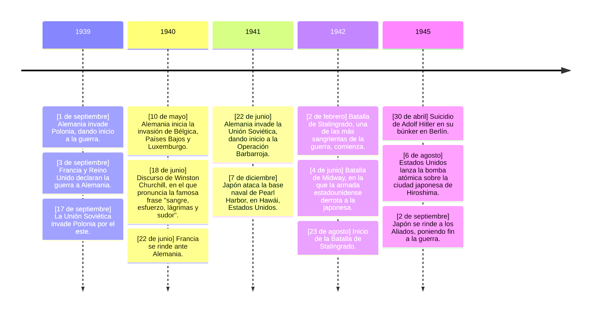

# Eventos más Importantes de la Segunda Guerra Mundial

```mermaid
timeline

1939 : [1 de septiembre] Alemania invade Polonia, dando inicio a la guerra.
     : [3 de septiembre] Francia y Reino Unido declaran la guerra a Alemania.
     : [17 de septiembre] La Unión Soviética invade Polonia por el este.
1940 : [10 de mayo] Alemania inicia la invasión de Bélgica, Países Bajos y Luxemburgo.
     : [18 de junio] Discurso de Winston Churchill, en el que pronuncia la famosa frase "sangre, esfuerzo, lágrimas y sudor".
     : [22 de junio] Francia se rinde ante Alemania.
1941 : [22 de junio] Alemania invade la Unión Soviética, dando inicio a la Operación Barbarroja.
     : [7 de diciembre] Japón ataca la base naval de Pearl Harbor, en Hawái, Estados Unidos.
1942 : [2 de febrero] Batalla de Stalingrado, una de las más sangrientas de la guerra, comienza.
     : [4 de junio] Batalla de Midway, en la que la armada estadounidense derrota a la japonesa.
     : [23 de agosto] Inicio de la Batalla de Stalingrado.
1945 : [30 de abril] Suicidio de Adolf Hitler en su búnker en Berlín.
     : [6 de agosto] Estados Unidos lanza la bomba atómica sobre la ciudad japonesa de Hiroshima.
     : [2 de septiembre] Japón se rinde a los Aliados, poniendo fin a la guerra.
```

